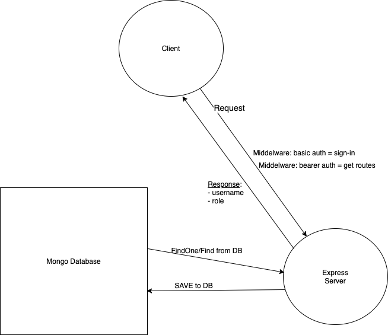

# nCompass

## Yoli Order-movement Dashboard Mock API

### Authors

Nathan Cox
Chad Larson

### Set Up

1. MongoDB

- start: `mongosh`;
- stop: `quit()`;

2. Server

- start: `npm start`;
- stop: `^c`;

### Routes

- Config controller path

  [x] GET: /api/Config/params
  [x] GET: /api/Config/maps

- CRM Orders path
  
  [x] GET one: /api/CrmOrders/crm-orders/{id}
  [x] GET all: /api/CrmOrders/Failed
  [ ] POST: /api/CrmOrders/Ignore
  [ ] POST: /api/CrmOrders/Repull
  [ ] POST: /api/CrmOrders/RepullAllowMismatch
  ([] POST: /api/CrmOrders/crm-order => add an order to the db)

- Staging Orders path

  [x] GET all: /api/StagingOrders/
  [x] GET one: /api/StagingOrders/{id}
  [x] GET: /api/StagingOrders/Failed
  [ ] GET: /api/StagingOrders/Failed/{daysBack}
  [x] GET: /api/StagingOrders/summary
  [ ] GET: /api/StagingOrders/summary/{gpPushStatusType}/{daysBack}
  [ ] POST: /api/StagingOrders/Ignore
  [ ] POST: /api/StagingOrders/Retry
  [ ] POST: /api/StagingOrders/Delete

- GP Orders path
  
  [x] GET: /api/GpOrders/gp-orders
  [x] GET one: /api/GpOrders/gp-orders/{id}
  [ ] GET: /api/GpOrders/pushorder/{orderNumber}
  [ ] GET: /api/GpOrders/push

- Purge data path (we did not discuss this. it should be another page and secured by the role auth so only admins can run this)
  
  [ ] GET: /api/Purge/DataLevels
  [ ] POST: /api/Purge/{monthsToKeep}

### Links and Resources

<!-- - [CI/CD]() -->
<!-- - [Back-end Server URL](http://xyz.com) (when applicable) -->
<!-- - [Front-end Application]() -->

#### Tests

#### UML

